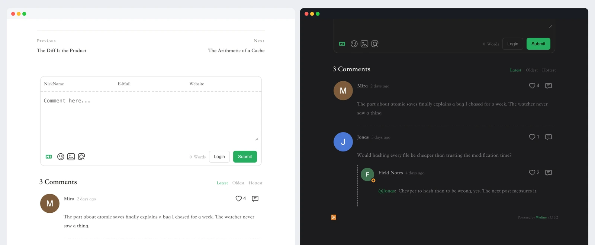

<p align="center">
  
</p>

<h1 align="center">评论</h1>

<p align="center">
  给 Kite 网站的每篇文章加上评论区。
</p>

<p align="center">
  <a href="https://github.com/kite-plus/plugin-comments/actions/workflows/ci.yml"></a>
  <a href="https://github.com/kite-plus/plugin-comments/releases/latest"></a>
  <a href="https://github.com/kite-plus/kite"></a>
  <a href="LICENSE"></a>
</p>

<p align="center">
  <a href="README.md">English</a> · 简体中文
</p>

<p align="center">
  
</p>

评论是 [Kite](https://github.com/kite-plus/kite) 的官方插件。在后台选好评论服务，每篇文章下面就会出现评论区：放在正文之后，样式和页面保持一致。

<p>
  
  
  
</p>

## 特点

- **三种评论服务**：[Giscus](https://giscus.app) 把评论存在 GitHub 仓库的 Discussions 里；[Waline](https://waline.js.org) 和 [Twikoo](https://twikoo.js.org) 部署在你自己的服务器上，Twikoo 也可以用腾讯云开发。
- **改地址不丢评论**：用 Giscus 时，文章按 ID 对应到讨论，文章改名、网站搬家，评论都还在。
- **跟随深色模式**：页面切到深色，评论区也跟着切换；无论主题是跟随系统，还是自带切换开关。
- **放在读者期待的位置**：正文结束、上一篇/下一篇之后，也可以放在主题标记的位置。
- **每篇文章自己决定**：在 front matter 里写 `comments: false`，这篇文章就不显示评论区；「关于」这类页面也可以打开评论。
- **国内加载快**：Waline 和 Twikoo 的脚本可以从 jsDelivr、unpkg 或 npmmirror 加载。

## 安装

1. 从[最新版本](https://github.com/kite-plus/plugin-comments/releases/latest)下载 `comments-<版本>.zip`。
2. 在 Kite 后台打开「插件」，把 zip 拖到「上传插件」上，然后打开开关。

也可以在站点目录里用命令行：

```sh
kite plugin add comments-0.1.0.zip
kite plugin enable comments
```

需要 Kite 0.1 及以上版本。

## 设置

在「插件 → 评论 → 设置」里，表单只显示所选服务需要填写的项。在 `localhost` 预览时，还没填好的设置会直接提示在评论区的位置。

| 设置 | 服务 | 说明 |
|---|---|---|
| 评论服务 | | Giscus、Waline 或 Twikoo |
| 仓库、仓库 ID、讨论分类、分类 ID | Giscus | 在 [giscus.app](https://giscus.app) 选好仓库和分类后复制过来 |
| 文章与讨论的对应方式 | Giscus | 文章 ID（默认）、地址中的路径、完整地址或文章标题 |
| 服务端地址 | Waline | 你部署的 Waline 服务端地址 |
| 环境 | Twikoo | 你部署的 Twikoo 服务端地址，或腾讯云开发的环境 ID |
| 页面也显示 | | 除文章外，「关于」等页面下也放评论区 |
| 脚本来源 | Waline、Twikoo | jsDelivr、unpkg 或 npmmirror |

## 给主题作者

评论区默认放在页面 `<main>` 的末尾。想放到别处，就在那里做个标记：

```html
<div data-kite-comments></div>
```

## 发布新版本

修改 `plugin.yaml` 里的 `version` 并提交，然后推送同名的标签，例如 `v0.1.0`。发布工作流会打包 `dist/comments-<版本>.zip` 并附到 GitHub Release 上。在本地运行 `make zip` 可以打出同样的文件，`kite plugin verify .` 会按站点加载插件的方式检查它。

## 其他官方插件

| 插件 | 作用 |
|---|---|
| [访问统计](https://github.com/kite-plus/plugin-analytics) | 用百度统计、Google Analytics、Umami 或 Plausible 统计访问量 |
| [公式与图表](https://github.com/kite-plus/plugin-math) | 用 KaTeX 排版 TeX 公式，把 mermaid 代码块画成图表 |
| [站内搜索](https://github.com/kite-plus/plugin-search) | 在读者的浏览器里搜索，不需要运行任何服务 |

## 许可证

[Apache License 2.0](LICENSE)。
